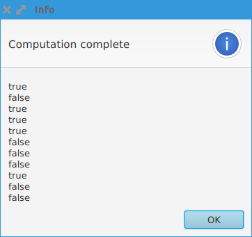
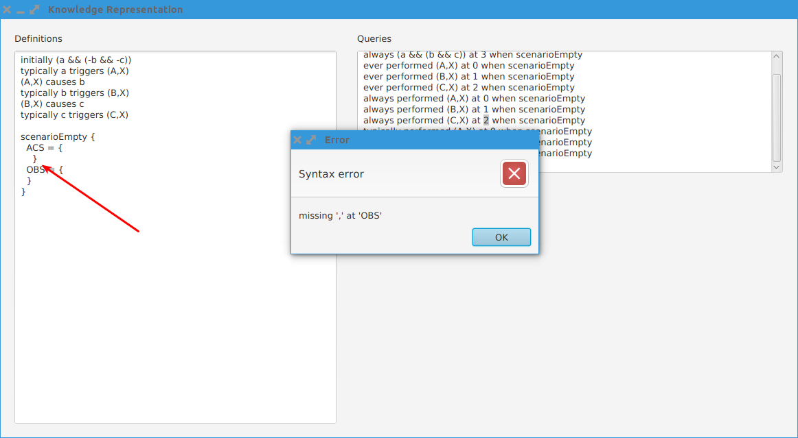
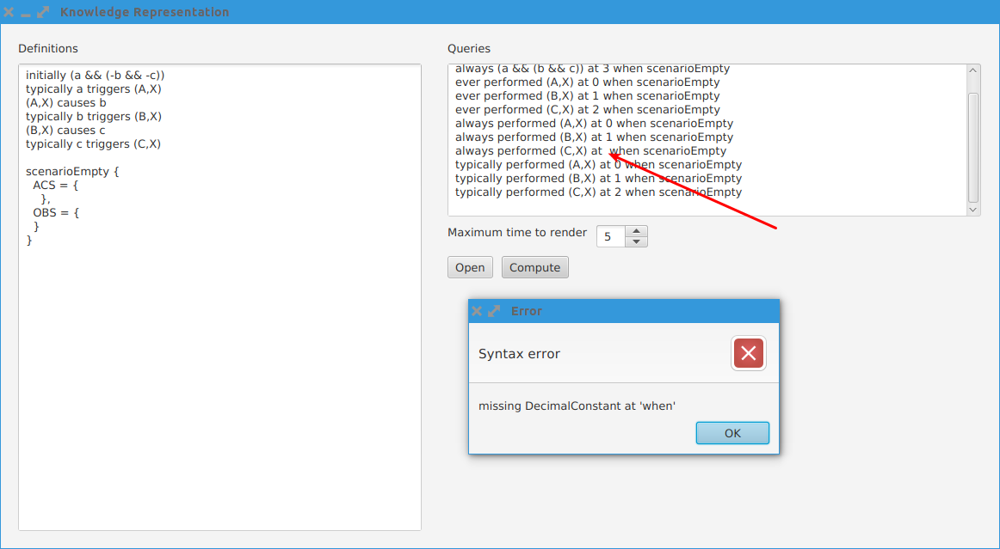

# Reprezentacja wiedzy


## Instalacja

TBD @tom8a

## Praca z programem

Okno programu składa się z

1. Pola tekstowego (podgądu) definicji
2. Pola tekstowego zapytań
3. Przycisku "Open" który otwiera menadżera plików w celu wybrania definicji do załadowania
4. Przyciski "Compute" który uruchamia obliczenia
5. Okna komunikatów


### Ładowanie definicji

Aby załadować definicje należy klinkąć przycisk "Open" i wybrać pożądany plik.
Plik zostanie załadowwany do pamięci i wyświetlony w polu "Definitions" tylko
do odczytu.

### Wpisywanie zapytań

Zapytania zgodne z gramatyką ustalonego języka akcji należy wpisywać w polu
"Queries".

### Uruchamianie obliczeń i odczytywanie wyniku

W celu otrzymania odpowiedzi na zapytania należy kliknąć przycisk "Compute".
Po zakończeniu obliczeń pojawi się Okno komunikatów w listą wyników `true/false/null`
dla odpowiednio prawdy, fałszu i zapytania obecnie nieobsługiwanego.




### Błędy

Jeśli wpisane zapytania, lub załadowany plik zawierają błędy to po kliknięciu
przycisku "Compute" natychmiast pojawi się Okno komunikatów z informacją o błędzie
oraz o najbardziej prawdopodobnym miejscu jego wystąpienia.





## Syntaktyka języka akcji

Gramatyka języka została opracowana w taki sposób aby wyelimionować
znaczenie białych znaków. Ponadto, aby ułatwić czytelność kodu
wszystkie sekcje są otoczone specjalnymi znakami.

1. Listy fluentów zawsze są otoczone przez nawiasy kwadratowe (`[]`)
```javascript
initially [dogHungry, -dogDead]
```

2. Każda akcja ma postać `(aktor, zadanie)`
```javascript
ever performed (dog, CommitSuicide) at 4 when scenarioOne
```

3. Scenariusz ma syntaktykę opartą o format [JSON](http://json.org/)

```javascript
scenario {
            ACS = {
                ((Janek, takesCard), 3),
                ((Janek, locksTheDoor), 4),
                ((Janek, comeback), 10)
            },
            OBS = {
                ([-hasCard, inHostel], 4),
                ([hasCard], 5),
                ([inHostel], 4)
            }
}
```

### Przykładowy program

* Plik definicji:

```javascript
initially [dogHungry, -dogDead]

[dogHungry, -dogDead] triggers (dog, Sad)
(dog, Sad) invokes (dog, CommitSuicide) after 5
(dog, CommitSuicide) causes [dogDead] if [dogHungry, -dogDead]

(dog, eats) causes [-dogHungry]

scenarioOne {
    ACS = {
    },
    OBS = {
    }
}
```

* Plik zapytań:

```javascript
ever [dogHungry] at 0 when scenarioOne
ever [-dogHungry] at 1 when scenarioOne
```
